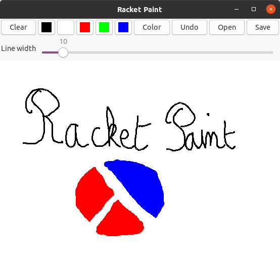

racket-paint
============

A simple paint program written in Racket.

# Installation

From DrRacket:
1. Install: In DrRacket, click on `File|Install Package…` then type `racket-paint` and Enter.
2. Launch: In a the interaction window, type `(require racket-paint)`.

Or from the command line:
1. Install: `raco pkg install racket-paint`
2. Launch: `racket -l racket-paint`

# Usage

Everything should be pretty obvious. Right-click on color buttons to change the color (or 
to pick one from the screen).
